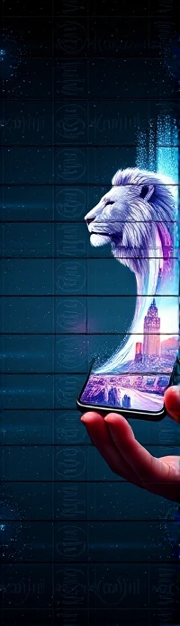

# 🎨 FLUX Image Generator

An elegant web application that harnesses the power of FLUX.1-schnell model by Black Forest Labs to generate high-quality images from text descriptions. This project combines FastAPI's robustness with a sleek, responsive UI to provide a seamless image generation experience.



## ✨ Features

- 🖼️ Generate high-quality images up to 2048x2048 resolution
- 🎯 Precise control over image dimensions
- 💫 User-friendly web interface
- 🚀 Fast image generation with FLUX.1-schnell model
- 🔌 RESTful API support for integration
- 📱 Responsive design that works on all devices
- 🔒 Optional Hugging Face token support

## 🚀 Quick Start

### Prerequisites

- Python 3.11+
- Docker (optional)
- Hugging Face API token (optional)

### Installation

1. **Clone the repository:**
   ```bash
   git clone https://github.com/wsmaisys/Flux-Image-Generator.git
   cd Flux-Image-Generator
   ```

2. **Install dependencies:**
   ```bash
   pip install -r requirements.txt
   ```

3. **Set up environment variables:**
   Create a `.env` file in the root directory:
   ```env
   HF_TOKEN=your_huggingface_token_here
   ```

4. **Run the application:**
   ```bash
   uvicorn app:app --reload
   ```

   Visit `http://localhost:8000` in your browser.

### 🐳 Docker Deployment

1. **Build the Docker image:**
   ```bash
   docker build -t flux-image-generator .
   ```

2. **Run the container:**
   ```bash
   docker run -p 8000:8000 --env-file .env flux-image-generator
   ```

## 🔧 API Usage

### Web Interface
Open `http://localhost:8000` in your browser to use the web interface.

### REST API

#### Generate Image
```bash
curl -X POST "http://localhost:8000/generate-image" \
  -H "Content-Type: application/json" \
  -d '{
    "prompt": "a beautiful sunset over mountains",
    "width": 1024,
    "height": 768,
    "return_format": "raw"
  }' \
  --output image.png
```

## 🎨 Examples

Here are some example prompts you can try:

- "A futuristic city skyline at sunset with flying cars"
- "An enchanted forest with glowing mushrooms and fairy lights"
- "A cyberpunk street scene with neon signs and rain"

## 🛠️ Technology Stack

- **Backend:** FastAPI
- **Model:** FLUX.1-schnell by Black Forest Labs
- **Frontend:** HTML5, CSS3, JavaScript
- **Container:** Docker
- **API:** RESTful with JSON

## 📝 License

This project is licensed under the MIT License - see the [LICENSE](LICENSE) file for details.

## 🙏 Acknowledgments

- [Black Forest Labs](https://huggingface.co/black-forest-labs) for the FLUX.1-schnell model
- [FastAPI](https://fastapi.tiangolo.com/) for the awesome web framework
- [Hugging Face](https://huggingface.co/) for the infrastructure

## 🤝 Contributing

Contributions are welcome! Please feel free to submit a Pull Request.

## 📧 Contact

Wasim Ansari - [@wsmaisys](https://github.com/wsmaisys)

Project Link: [https://github.com/wsmaisys/Flux-Image-Generator](https://github.com/wsmaisys/Flux-Image-Generator)
